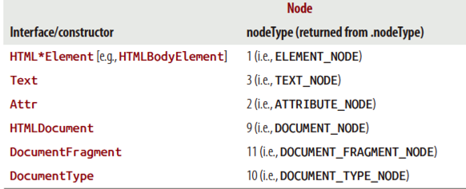

[toc]

## Node

### 1.2 Node 对象类型

常见的节点类型：

- `DOCUMENT_NODE` (e.g., `window.document`)
- `ELEMENT_NODE` (e.g., `<body>`, `<a>`)
- `ATTRIBUTE_NODE` (e.g., `class="funEdges"`)
- `TEXT_NODE` (e.g., text characters in an HTML document including carriage returns and whitespace)
- `DOCUMENT_FRAGMENT_NODE` (e.g., `document.createDocumentFragment()`)
- `DOCUMENT_TYPE_NODE` (e.g., `<!DOCTYPE html>`)

上述类型是 `Node` 对象的静态变量，如 `Node.ELEMENT_NODE`。它们的值是整数。

接口（或构造器）与对应的 `nodeType`。如 `document.nodeType == Node.DOCUMENT_NODE`。



### 1.3 Node 的子类型

一些继承关系：

- `Object` < `Node` < `Element` < `HTMLElement` < (e.g., HTML*Element)
- Object < Node < Attr (this is deprecated in DOM4)
- Object < Node < CharacterData < Text
- Object < Node < Document < HTMLDocument
- Object < Node < DocumentFragment

> {{查看Chrome的控制台，上面的继承关系有变化。`Node` 先继承 `EventTarget`。}}

### 1.4 Node 的属性和方法

`Node` 属性：

- childNodes
- firstChild
- lastChild
- nextSibling
- nodeName
- nodeType
- nodeValue
- parentNode
- previousSibling

`Node` 方法：

- `appendChild()`
- `cloneNode()`
- `compareDocumentPosition()`
- `contains()`
- `hasChildNodes()`
- `insertBefore()`
- `isEqualNode()`
- `removeChild()`
- `replaceChild()`

`Document` 方法：

- `document.createElement()`
- `document.createTextNode()`

`HTML*Element` 属性

- `innerHTML`
- `outerHTML`
- `textContent`
- `innerText`
- `outerText`
- `firstElementChild`
- `lastElementChild`
- `nextElementChild`
- `previousElementChild`
- `children`

`HTML*Element` 方法：

- `insertAdjacentHTML()`

### 1.5 识别节点类型和名字

每个 `Node` 对象都有 `nodeType` 和 `nodeName` 属性。例如，`Text` 的 `nodeType` 等于 `Node.TEXT_NODE`，`nodeName` 等于 `#text`。

The values returned by the nodeName property vary according to the node type. See the DOM4 specification for details.

### 1.6 获取节点的值

The `nodeValue` property returns null for most of the node types except `Text` and `Comment`. Its use is centered on extracting actual text strings from `Text` and `Comment` nodes.

```
	<a href="#">Hi</a>
    console.log(document.querySelector('a').firstChild.nodeValue);
```

`Text` or `Comment` node values can be set by providing new string values for the `nodeValue` property (i.e., `document.body.firstElement Child.nodeValue = 'hi'`).

### 1.7 创建 Element 和 Text 节点

```js
var elementNode = document.createElement('div');
var textNode = document.createTextNode('Hi');
```

The `createElement()` method accepts one parameter that is a string specifying the element to be created. The string is the same string that is returned from the `tagName` property of an `Element` object.

### 1.8 利用字符串创建、添加元素和文本节点

The `innerHTML`, `outerHTML`, `textContent`, and `insertAdjacentHTML()` properties and methods provide the functionality to create and add nodes to the DOM using JavaScript strings.

```js
	document.getElementById('A').innerHTML = '<strong>Hi</strong>';

	/* create a div element and text node to replace <span id="B"></div>
	(notice span#B is replaced) */
	document.getElementById('B').outerHTML = '<div id="B" class="new">Whats Shaking</div>'

	// create a text node and update the div#C with the text node
	document.getElementById('C').textContent = 'dude';

	// 注意 innerText 和 outerText 是非标准扩展
	// create a text node and update the div#D with the text node
    document.getElementById('D').innerText = 'Keep it';

    /* create a text node and replace the div#E with the text node
	(notice div#E is gone) */
	document.getElementById('E').outerText = 'real!';
```

`Element` 的 `insertAdjacentHTML()` 方法更精确，可以控制在开始标签前、后，结束标签前、后插入。

```js
var elm = document.getElementById('elm');
elm.insertAdjacentHTML('beforebegin', '<span>Hey-</span>');
elm.insertAdjacentHTML('afterbegin', '<span>dude-</span>');
elm.insertAdjacentHTML('beforeend', '<span>-are</span>');
elm.insertAdjacentHTML('afterend', '<span>-you?</span>');
```

`beforebegin` 和 `afterend` 仅当节点已在DOM树中且有父节点时有效。

`textContent` gets the content of all elements, including `<script>` and `<style>` elements, but `innerText` does not. `innerText` is aware of style and will not return the text of hidden elements, whereas `textContent` will.

Available to all modern browsers except Firefox are `insertAdjacentElement()` and `insertAdjacentText()`.

### 1.9 抽出部分DOM为字符串

仍使用 `innerHTML`、`outerHTML`、`textContent` 几个属性。

```
	<div id="A"><i>Hi</i></div>
    <div id="B">Dude<strong> !</strong></div>
	console.log(document.getElementById('A').innerHTML); //logs '<i>Hi</i>'
    console.log(document.getElementById('A').outerHTML);
    /* logs <div id="A">Hi</div> */

    /* notice that all text is returned even if it's in child element nodes (i.e., <strong> !</strong>) */
    console.log(document.getElementById('B').textContent); //logs 'Dude !'
    // NON standard extensions below i.e., innerText and outerText
    console.log(document.getElementById('B').innerText); //logs 'Dude !'
    console.log(document.getElementById('B').outerText); //logs 'Dude !'
```

### 1.10 利用 `appendChild()` 和 `insertBefore()` 向 DOM 添加节点

`appendChild()` 将一个或多个节点添加到指定节点最后。

```js
// create a blink element node and text node
var elementNode = document.createElement('strong');
var textNode = document.createTextNode(' Dude');
// append these nodes to the DOM
document.querySelector('p').appendChild(elementNode);
document.querySelector('strong').appendChild(textNode);
```

`insertBefore()` 在指定节点之前插入节点。

```js
var li = document.createElement('li');
var ul = document.querySelector('ul');
ul.insertBefore(li, ul.firstChild);
```

We have more methods (e.g., `prepend()`, `append()`, `before()`, and `after()`) to look forward to in DOM4.

### 1.11 利用 `removeChild()` 和 `replaceChild()` 删除或替换节点

```js
//remove element node
var divA = document.getElementById('A');
divA.parentNode.removeChild(divA);
//remove text node
var divB = document.getElementById('B').firstChild;
divB.parentNode.removeChild(divB);
```

```js
//replace element node
var divA = document.getElementById('A');
var newSpan = document.createElement('span');
newSpan.textContent = 'Howdy';
divA.parentNode.replaceChild(newSpan,divA);
//replace text node
var divB = document.getElementById('B').firstChild;
var newText = document.createTextNode('buddy');
divB.parentNode.replaceChild(newText, divB);
```

Depending on what you are removing or replacing, simply providing the `innerHTML`, `outerHTML`, and `textContent` properties with an empty string might be easier and faster. Be careful, however, as [memory leaks
in the browser might come back to haunt you](http://javascript.crockford.com/memory/leak.html).

`replaceChild()` and `removeChild()` return the replaced and removed node, respectively. Basically, the node is not gone just because you replace or remove it. These actions simply take the node out of the current live document. You still have a reference to it in memory.

We have more methods (e.g., `replace()`, `remove()`) to look forward to in DOM4.

### 1.12 利用 `cloneNode()` 克隆节点

`cloneNode()` 克隆节点本身，`cloneNode(true)` 克隆节点及其子节点。

```js
var cloneUL = document.querySelector('ul').cloneNode();
```

当克隆的是一个 `Element` 节点时，它的所有 attributes，包括内联事件，都会被克隆。但通过 `addEventListener()` 或 `node.onclick` 添加的不会。

`cloneNode()` may lead to duplicate element IDs in a document.

### 1.13 节点的集合 `NodeList`、`HTMLCollection`

When selecting groups of nodes from a tree (see Chapter 3) or accessing predefined sets of nodes, the nodes are placed in either a `NodeList` [e.g., `document.querySelector All('*')`] or an `HTMLCollection` (e.g., `document.scripts`). These array-like object collections have the following characteristics:

- A collection can be either live or static. This means the nodes contained in the collection are either literally part of the live document or a snapshot of the live document.
- By default, nodes are sorted inside the collection by tree order. This means the order matches the linear path from tree trunk to branches.
- The collections have a `length` property that reflects the number of elements in the list.

### 1.14 获取所有直接子节点

`childNodes` 只包含所有的直接的孩子，结果是 `NodeList`。

```js
var ulElementChildNodes = document.querySelector('ul').childNodes;

Array.prototype.forEach.call(ulElementChildNodes, function(item) {
	console.log(item); //logs each item in the array
});
```

Be aware that childNodes contains not only `Element` nodes but also all other node types (e.g., `Text` and `Comment` nodes).

### 1.15 将 NodeList 或 HTMLCollection 转换为数组

```js
Array.isArray(Array.prototype.slice.call(document.links));
Array.isArray(Array.prototype.slice.call(document.querySelectorAll('a')));
```

In ECMAScript Edition 6, we have `Array.from` to look forward to, which converts a single argument that is an array-like object or list (e.g., `arguments`, `NodeList`, `DOMTokenList` [used by `classList`], and `NamedNodeMap` [used by the `attributes` property]) into a new `Array()` and returns it.

### 1.16 游走

从一个节点开始，利用以下属性可以在DOM中游走： `parentNode`、 `firstChild`、 `lastChild`、 `nextSibling`、 `previousSibling`。

上述方法在游走过程中包含文本和注释节点。如果想忽略这些节点，可以使用： `firstElementChild`、 `lastElementChild`、 `nextElementChild`、 `previousElementChild`、 `children`、 `parentElement`。

`childElementCount` 给出子元素的数量。

### 1.17 节点相对位置：`contains()` 和 `compareDocumentPosition()`

`contains` 查询一个节点是否位于另一个节点内部：

```js
document.querySelector('html').contains(document.querySelector('body'));
```
传入的节点与给定的节点是同一个节点，`contains` 返回 true。

`compareDocumentPosition()` 给出一个节点相对于另一个节点的位置。返回值是一个整数，取值如下：

- `0`：同一个元素。
- `DOCUMENT_POSITION_DISCONNECTED`：1, 两个元素不属于同一个文档。
- `DOCUMENT_POSITION_PRECEDING`：2, 传入的节点位于给定节点之前。
- `DOCUMENT_POSITION_FOLLOWING`：4, 传入的节点位于给定节点之后。
- `DOCUMENT_POSITION_CONTAINS`：8, Set when passed-in node is an ancestor of selected node.
- `DOCUMENT_POSITION_CONTAINED_BY`：16, Set when passed-in node is a descendant of selected node.

`compareDocumentPosition()` can be rather confusing, because it’s possible for a node to have more than one type of relationship with another node. For example, when a node both contains (16) and precedes (4), the returned value from `compareDocumentPosition()` will be 20.

### 1.18 判断两个节点是否相等

根据 DOM3 specification，两个节点相等的条件有：

- 类型相同
- 以下字符串属性相等：`nodeName`、 `localName`、 `namespaceURI`、 `prefix`、 `nodeValue`。That is, they are both null, or they have the same length and are identical character for character.
- The `attributes` `NamedNodeMaps` are equal. That is, they are both null, or they have the same length and for each node that exists in one map, there is a node that exists in the other map and is equal, although not necessarily at the same index.
- The `childNodes` `NodeLists` are equal. That is, they are both null, or they have the same length and contain equal nodes at the same index. Note that normalization can affect equality; to avoid this, nodes should be normalized before being compared.

Calling the `isEqualNode()` method on a node in the DOM will ask if that node is equal to the node that you pass it as a parameter.

```
	<input type="text">
    <input type="text">
    // logs true, because they are exactly identical
    var input = document.querySelectorAll('input');
    console.log(input[0].isEqualNode(input[1]));
```

比较两个节点是否为同一个，直接用 `===`。


