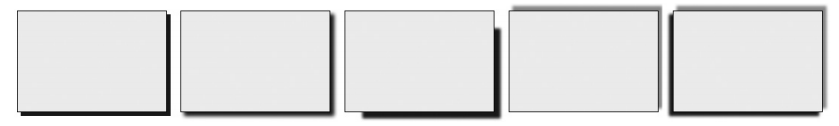
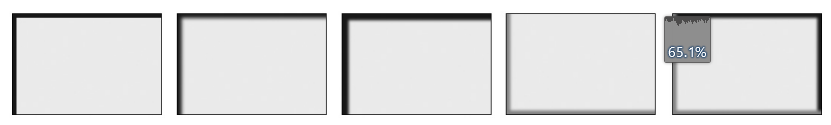
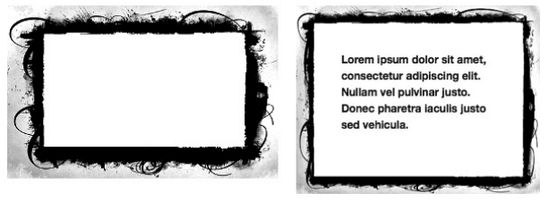
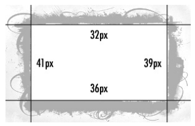
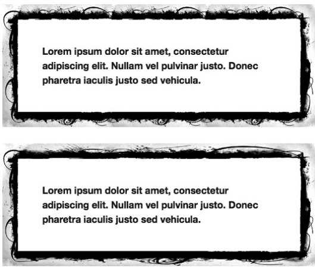

[toc]

# border

## 圆角

圆角可以是正圆或椭圆：

```css
border-v-h-radius: x y;
```

其中 `v` 可取 `top` 或 `bottom`，`h` 可取 `left` 或 `right`。`x` 和 `y` 是定义椭圆的两个轴。

```css
border-top-right-radius: 20px 20px;
```

如果是正圆弧，即 x 和 y 值相同，则可以只指定一个值，如：

```css
border-top-left-radius: 20px;
```

缩写使用`border-radius`：

```css
border-radius: top-left top-right bottom-right bottom-left;
```

如果只指定两个值，第一个值作用于左上、右下，第二个值作用于右上、左下。如果指定三个值，第一个值作用于左上，第二个值作用于右上、左下，第三个只作用于右下。

这种缩写只适用于圆角是正圆弧，即 x 和 y 相同。对于非正圆弧，也可以使用缩写，两个轴通过斜杠分隔：

```css
border-radius: { horizontal-radius / vertical-radius; }
```

每个轴可以指定一到四个值。

```css
.radius-1 { border-radius: 20px / 10px; }
.radius-2 { border-radius: 20px / 10px 20px; }
.radius-3 { border-radius: 10px 20px 20px / 20px 10px; }
```

## 阴影

用 `box-shadow` 给盒元素铁添加阴影。

```css
box-shadow: inset horizontal vertical blur spread color;
```

第一个值 `inset`，可选，设置应用在元素内还是元素外；若不指定，阴影将在元素外。接下来两个值值是长度，设置阴影与盒子的水平和垂直距离。接下来设置羽化半径。`spread`设置阴影散开的距离{{相对于盒子的大小}}：正值让阴影比元素大一点，负值小一点。这两个值都是可选的。最后是颜色。在 WebKit 中这个值必须指定。

```css
.shadow-one { box-shadow: 4px 4px; }
.shadow-two { box-shadow: 4px 4px 3px; }
.shadow-three { box-shadow: 12px 12px 2px -6px; }
.shadow-four { box-shadow: #999 4px -4px 2px 0; }
.shadow-five { box-shadow: #999 4px -4px 2px 0, -4px 4px 2px; }
```



第三个设置 `spread` 为 `–6px`，即让阴影比盒子小一点。

{{内阴影}}若指定 `inset`，这个关键字将导致阴影绘制在盒子内，同时有把阴影反转到盒子另一边的效果。例如，正常的 outset 的阴影，正的水平垂直偏移将在盒子的右下角显示，但 inset 阴影将显示在左上角。

重复上面的例子，但添加 `inset` 关键字：

```css
.shadow-one { box-shadow: inset 4px 4px; }
.shadow-two { box-shadow: inset 4px 4px 3px; }
.shadow-three { box-shadow: inset 12px 12px 2px -6px; }
.shadow-four { box-shadow: inset #999 4px -4px 2px 0; }
.shadow-five { box-shadow: inset #999 4px -4px 2px 0, inset -4px 4px 2px; }
```



## 图像做边框

CSS3 之前是无法直接做到的。CSS3 新提供 `border-image` 属性。

```css
border-image: source slice / width repeat;
```

However, as only Firefox supports the width value, the safe implementation would use this syntax:

```css
border-image: source slice repeat;
```

`source` 是图片的URL。

`slice` 是一个长度或百分比值（或多个值），用法见下面的粒子。`slice` 可以是 1 到 4 个值，类似于 margin。

`repeat` 取一到两个关键字。第一个关键字控制上下，第二个控制左右。取值包含：`stretch`，拉伸图像填满边框宽度；`repeat`，重复图像以填满长度；`round`，重复整数次（不会有图像显示不全），然后缩放以充满；`space`，重复整数次（不会有图像显示不全），多余空间填充在图片之间。

```css
border-image: url('frame.png') 32 39 36 41 stretch;
border-width: 20px;
```

注意到数字没有单位：对于位图，它们是像素值；对于矢量图（如 SVG），它们是坐标值。下面左边是我打算用作边框图片的原图。右边是最终效果：



The next four numerical values set the areas I want to slice: 32px from the top, 39px from the right, 36px from the bottom, and 41px from the left. These values specify **which parts of frame.png** I want to use as my top, right, bottom, and left borders, respectively. Figure 9-8 shows where my slices are on my frame image.



图像被分隔为9个片段：4个边4个角一个中心。The corners and the center will always remain constant, scaling to fill their set positions, but the four sides can be modified with the values specified in the property. In this example, I’ve set the `repeat` value to stretch, which means the side slices will be stretched to fill the length (height or width) of the element. I also set a `border-width` of 20px on each side, so my image slices are scaled to fit inside that limit. Now to illustrate the difference between the `stretch` and `round` keywords for the `repeat` value. Check out this code:

```css
.bimage-1 { border-image: url('frame.png') 32 39 36 41 round stretch; }
.bimage-2 { border-image: url('frame.png') 32 39 36 41 stretch; }
```



In the module itself, border-image is said to be the shorthand for a series of subproperties:

```css
border-image-source: image;
border-image-slice: length; /* Up to four values allowed */
border-image-width: length; /* Up to four values allowed */
border-image-outset: length; /* Up to four values allowed */
border-image-repeat: keyword; /* Up to two values allowed */
```

The `border-image-width` property has the same syntax as the slice value but a different function: It sets the width of the element’s border and takes precedence over `border-width`. (`border-image-width` is used to provide a fallback state, as with `text-fill-color`, which I introduced in Chapter 6.) As I mentioned previously, you can use this property in Firefox’s shorthand property but not in other browsers. The `border-image-outset` property also uses the same syntax as slice, but it sets the length that the border can extend **outside** the element.

These properties were only introduced to the specification at the end of 2009, however, and as of this writing, no browser supports them, although they are likely to be implemented in the future.

