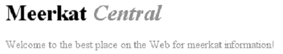

[toc]

# CSS 基础

link 元素只能放入 head。

## 元素类型

### 替换元素与非替换元素

CSS 中，元素通常有两种形式：被替换和非替换。这两种类型将在第7章做详细讨论。这里简短介绍。

* 被替换元素（relaced element）：可被替换元素是指元素内容并非由文档内容直接表示。例如 img 元素和 input 元素。
* 非替换元素（nonreplaced element）：大多数 html 元素都是不可替换元素，其内容在元素本身的框中显示。如 div、p。

### 块级与内联

CSS2.1 使用两种基本元素类型：块级元素和内联（inline）元素（也称行内元素）。二者区别是是否独占一行。

注意块和内联这两个概念与 HTML 中的块级和行内元素不同！在 HTML 中，块级元素不能放入行级元素中。但 CSS 不对嵌套做限制。

## 值和单位

### `em`、`ex`

`em` 是给定字体的 `font–size` 值。`ex` 是小写字母 x 的高度。相同像素数的不同字体的 x 的高度可能不同。多数字体没有内置的 ex 值，一般假设为 `0.5em`。

### `inherit`

`inherit` 是所有属性都有的属性值。虽然多数时候不需要使用 `inherit`（自然会继承），但有时是有用的{{默认不继承的时候}}。如指定锚文本颜色：

```css
#toolbar {background: blue; color: white;}
#toolbar a {color: inherit;}
```
```html
<div id="toolbar">
    <a href="one.html">One</a> | <a href="two.html">Two</a> |
    <a href="three.html">Three</a>
</div>
```

## 层叠与继承

**继承**（inheritance）是从一个元素向其后代元素传递属性值所采用的机制。确定应当向一个元素应用哪些值时，浏览器不仅要考虑继承，还要考虑声明的特殊性和声明本身的来源。这个过程称为**层叠**（cascade）。

### 特殊性

一个元素可能被多个选择符适配，如：

```css
h1 {color: red;}
body h1 {color: green;}
```

最终特殊性高的胜出。特殊性由四个值构成。

* 选择符中指定了 id 属性：0,1,0,0
* 类选择符、属性选择符、伪类选择符：0,0,1,0
* 元素和伪元素选择符：0,0,0,1
* 结合符（Combinators）和通用选择符（universal selector）不对特殊性有任何贡献：0,0,0,0。
* 内联样式的特殊性为 1,0,0,0

例子：

```css
h1 {color: red;}  /* specificity = 0,0,0,1 */
p em {color: purple;}  /* specificity = 0,0,0,2 */
.grape {color: purple;}  /* specificity = 0,0,1,0 */
*.bright {color: yellow;}  /* specificity = 0,0,1,0 */
p.bright em.dark {color: maroon;}  /* specificity = 0,0,2,2 */
#id216 {color: blue;}  /* specificity = 0,1,0,0 */
div#sidebar *[href] {color: silver;}  /* specificity = 0,1,1,1 */
```

`!important` 放在分号前，只作用于一个属性。若想作用多个属性，需要分别加。

```css
p.dark {color: #333 !important; background: white !important;}
```

重要声明与非重要声明是分开的两组。重要声明比非重要声明优先。重要声明的冲突会在重要声明内部解决。非重要声明的冲突通过特殊性解决。

### 继承

有些属性会被后代继承，有些不会。比如如大多数框模型属性（包括外边距、内边距、背景、边框）都不能继承。

继承的值没有特殊性，甚至连 0 特殊性都没有。**0 特殊性比没有特殊性要强**。

```css
* {color: gray;}
h1#page-title {color: black;}
```
```html
<h1 id="page-title">Meerkat <em>Central</em></h1>
<p>
Welcome to the best place on the web for meerkat information!
</p>
```



斜体是灰色的，原因是通配选择符作用于它。

通配选择符的0特殊性有一种短路效果｛｛阻止继承｝｝。

### 层叠

CSS 2.1 的层叠规则：

1. 按显式权重对所有声明排序。`!important` 的权重最高。
2. 按特殊性排序。特殊性高的权重高。
3. 按出现顺序排序。后面的覆盖前面的。如果样式表中有导入的样式表，一般认为导入样式表的声明在前，主样式表的声明在后。

由于顺序问题，推荐按以下顺序声明链接样式。一般建议按 `LVHA` 顺序声明：

```css
:link {color: blue;}
:visited {color: purple;}
:hover {color: red;}
:active {color: orange;}
```

它们的权重相同，因此按出现顺序排序。

如果按下面的顺序：

```css
:active {color: orange;}
:hover {color: red;}
:link {color: blue;}
:visited {color: purple;}
```

按照这种顺序，任何链接都不会显示 `:hover`或 `:active` 样式。所有链接要么是已访问的要么是未访问的。所以 `:link` 和 `:visited` 样式总会覆盖 `:hover` 规则。

