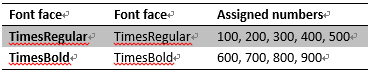
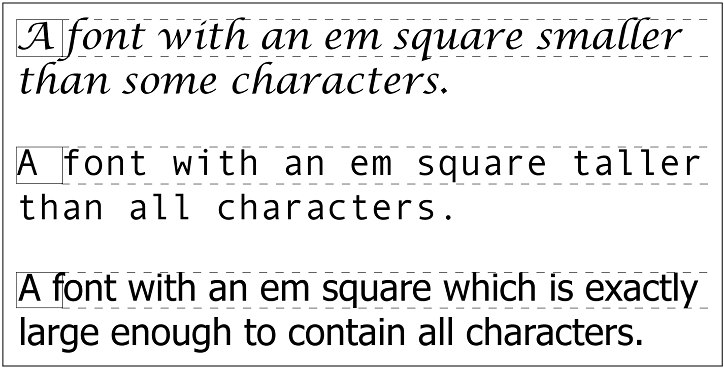

[toc]

# 文本

## Font Family

Times 实际是一个字体集（font family），而不是单个字体。它包含 TimesRegular, TimesBold, TimesItalic, TimesOblique, TimesBoldItalic, TimesBoldOblique 等多个字体。Times 的每个字体变形都是一个具体的**字体风格（font face）**。

除了具体的字体集（如 Times, Verdana, Helvetica, Arial），CSS 定义了 5 个通用的字体集：

- Serif。成比例。（如果字体中所有字符根据其不同大小有不同的宽度，则称该字体是成比例的。）有衬线。代表字体：Times, Georgia, New Century Schoolbook。
- Sans–serif。成比例。无衬线。代表字体：Helvetica, Geneva, Verdana, Arial, Univers。
- Monospace。等宽字体。代表字体有：Courier, Courier New, Andale Mono。
- Cursive。手写字体。代表字体有Zapf Chancery, Author, Comic Sans。

理论上用户的任何字体都会落入上述某种通用系列中。

例子，在 `font-family` 中使用通用字体集，如 `sans-serif`，而不关心具体是哪一种：

```css
body {font-family: sans-serif;}
```

若指定字体找不到，将用浏览器默认字体。更好的方式是具体字体集，再附加一个通用字体系列：

```css
h1 {font-family: Georgia, serif;}
```

多个字体用逗号分隔。字体名如果有空格，或包含 `#` 或 `$` 之类的符号，要加引号（单引号或双引号均可）。

## 加粗

`font-weight`。

* 继承：是！
* 初始值：normal。
* 取值：normal | bold | bolder | lighter | 100 | 200 | 300 | 400 | 500 | 600 | 700 | 800 | 900 | inherit

CSS 加粗有**9级**加粗度。值分别为 100 到 900。OpenType 也有 9 级梯度。如果一个字体内置了这些加粗级别，那边数字就直接映射到预定义级别。

调整粗细后，字体看起来到底能不能变粗或变细。取决于字体集（Family）中是否有与 `font-weight` 对应的字体（Font Face）。例如，若字体是 Times，指定 `font-weight: bold`，会使用某种“加粗变形”的字体（Font Face）显示，如 `TimesBold`。

CSS 规范规定这 9 级加粗的级别，只要求每个数字至少与前一个数字加粗度相同。如 100、200、300、400 可能都映射到相同的粗细。

数字一般有等价的变形名。400 等价于 normal，700 等价于 bold。

如果字体系列中定义的加粗度小于 9 种，使用下面规则填补“空白”：

* 若未指定 500 的加粗度，与 400 相同。
* 若未指定 300 的加粗度，则用下一个比 400 更细的级别，如果没有这样一个级别，使用 400 的级别。200 和 100 也适用这种情况。
* 如果未指定 600 的加粗度，则用下一个比 400 更粗的变形。若没有这样一个级别，使用 500 的级别。700、800、900也适用这种情况。

例子：




将 `font–weight` 设置为 `bolder`，根据从父元素继承的值，选择下一个更大的数。{{即，`border`  和 `lighter` 相对于父元素。}}

## 字体大小

字体本身有一个 em 方框，它是没有行间距时字体基线间的距离。字体的高度可能超过这个框。`font–size` 指定的是这个框的大小。



百分数值总是基于从父元素继承的大小来计算。`em` 等价于百分数。对于字体大小 `1em`等于 `100%`。

例子：

```css
p {font-size: 12px;}
em {font-size: 120%;}
strong {font-size: 135%;}

<p>This paragraph contains both<em>emphasis and <strong>strong
emphasis</strong></em>, both of which are larger than the paragraph text. </p>
<p> 12px <em>14.4px <strong> 19.44px </strong></em> 12px  </p>
```

则 `strong` 元素的字体大小为：

```
12 px × 120% × 135% = 19.44px (possibly rounded to 19px)
```

不过很多浏览器会做取整处理（跟连乘的结果不同）：

```
12px × 120% = 14.4px [14.4px ≈ 14px]
14px × 135% = 18.9px [18.9px ≈ 19px]
```

## style

`font-style`：

* 继承：是！
* 初始值：`normal`。
* 取值：italic | oblique | normal | inherit

`italic` 和 `oblique` 完全不同。`italic` 是一种单独的字体风格。`oblique` 是对正常竖直文本做倾斜。标为 Italic, Cursive 和 Kursiv 的字体总是映射到 `italic` 关键字，而 `oblique` 总是对应到标为 Oblique, Slanted 和 Incline 的字体。

实际中的字体很少同时有 italic 和 oblique 版本。即便同时有，浏览器也很少能区别开。

如果没有 italic 字体，但有 oblique 字体，则在需要前者的地方使用后者。若反过来，则在需要 oblique 的地方浏览器根据竖直字体计算一个倾斜版本。

## 缩进

`text-indent`：

* 继承：是！
* 初始值：0。
* 百分比：相对于包含块的宽度。**适用于：块级元素**。
* 取值：`<length> | <percentage> |inherit`。

例子：

```css
p {text-indent: -4em;}
```

**只能对块级元素使用**。`text–indent` 不能对内联元素或可替换元素使用。

`text–indent` 还可以接受负值，形成悬挂缩进。

百分数相对于缩进元素的父元素的宽度。

## 水平对齐

`text-align`：

* 继承：是！
* 适用于：**块级元素**。
* 取值：`left | center | right | justify | inherit`。

`text–align` **只能用于块级元素**。

若使用 `justify`，由浏览器决定如何拉伸，是增加单词间的空间还是字母间空间（不过 CSS 规范特别指出，如果 `letter–spacing` 属性指定了一个长度值，则浏览器不能进一步调整字符间空间）。CSS也没有指定如何处理连字符。

## 行高

`line-height`：

* 继承：是！
* 初始值：normal。
* 适用于：所有元素。
* 取值：`<length> | <percentage> | <number> | normal | inherit`。
* 百分比：相对于元素的字体大小。

`line–height` 指定的是文本行基线之间的距离。

若应用到块元素，`line-height` 定义元素内文本基线的最小距离。注意它只是定义一个最小距离，不是绝对值。`line-height` 不影响被替换元素的布局，但却是可以对这些元素使用该属性。

**构造一行**

一个文本行内的每个元素都会产生一个内容区，由字体的大小决定。这个内容区会产生一个内联盒子，若没有其他因素，与内容区相同。`line-height` 产生的 leading（见下图）是导致内联盒子高度增加或降低的原因之一。

一行内容中所有的内联盒子都产生后，它们一起构成行盒。行盒恰好容纳最高的内联盒子盒最低的内联盒子。


若不显式指定 `line–height`，浏览器会根据字体计算，一般为字体大小的 1.2 倍。`em` 和百分数值都相对于元素的 `font–size` 值计算。

**行高和继承**

```css
body {font-size: 10px;}
div {line-height: 1em;} /* computes to '10px' */
p {font-size: 18px;}
```

p 从 div 继承行高，继承来的值为 10px，这可能不是你想要的。

## 垂直对齐文本

`vertical-align`：

* 继承：不。
* 初始值：baseline。
* 适用于：内联元素和表格单元格。
* 百分比：相对元素的行高。
* 取值：`baseline | sub | super | top | text-top | middle | bottom | text-bottom | <percentage> | <length> | inherit`。用于单元格时，只能使用 baseline, top, middle, bottom。

注意 `vertical–align` 只用于**内联元素和可替换元素（图像、表单）**。 `vertical–align` 不被继承。

**基线对齐**

`baseline` 要求元素的基线**与父元素的**基线对齐。如果元素没有基线（图像、表单控件），那么元素的**底端**与父元素基线对齐。

可能的问题：假设表单元格中只有一个图像，这个图像一般显示在基线上。一些浏览器会保留基线下的空白，另一些会让单元格仅仅包围图像。See my article [“Images, Tables, and Mysterious Gaps”](http://developer.mozilla.org/en/docs/Images,_Tables,_and_Mysterious_Gaps) for a more detailed explanation of gap behavior and ways to work around it. Chapter 7 also covers this aspect of **inline layout** in more detail.

**上标和下标**

sub（下标）使元素的基线相对于父元素基线降低。降低的距离因浏览器而异。super 是上标。注意 sub 和 super 不会改变元素的字体大小。

**底端对齐**

`vertical-align: bottom` 对齐元素的内联盒子的底端到行盒的底端。

**顶端对齐**

`vertical–align:top` 的效果与 `bottom` 相反。

**居中对齐**

`middle` 对齐内联元素盒子盒中点到父元素基线上方 0.5ex 的点。ex 相对于父元素的 `font-size`。

**百分数**

百分数使元素的基线（对于替换元素是底边）相对于**父元素的基线**升高或降低。百分比相对于行高。

```
sub {vertical-align: -100%;}
sup {vertical-align: 100%;}
```

**数值**

把元素升高或降低指定距离。

## 处理空白符

`white-space`：

* Values: normal | nowrap | pre | pre-wrap | pre-line | inherit
* 初始值：normal
* Applies to: All elements (CSS2.1);
* Inherited: No
* Computed value: As specified

XHTML 默认会将所有连续空白符合并为一个空格。例如下面的例子，单词之间只会有一个空格而且**忽略换行**。

```html
<p>This    paragraph   has     many
spaces        in it.</p>
```

可以用 `p {white-space: normal;}` 显式的使用这种行为。

`pre` 将保留空白符。`nowrap` 将阻止文本换行，除非遇到一个 `br`。
