[toc]

# 3D 变换

## 透视

要激活 3D 空间，元素需要透视。

下图中，粉色是原来的未经变换的元素，橙色是变换后的元素：

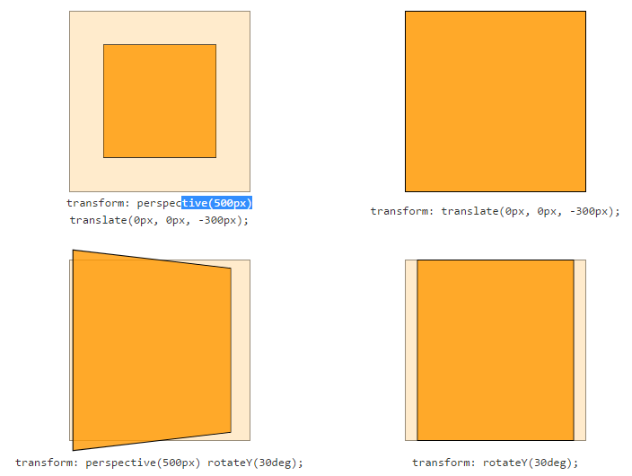

可以通过两种方式：使用 `perspective` 属性或使用 `perspective` 函数：

```css
-webkit-perspective: 600;
-webkit-transform: perspective(600);
```

```css
#red .box {
    background-color: red;
    transform: perspective( 600px ) rotateY( 45deg );
}
```

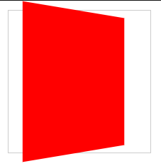

使用属性的例子。注意这里属性加在父容器上！

```css
#blue {
    perspective: 600px;
}

#blue .box {
    background-color: blue;
    transform: rotateY(45deg);
}
```

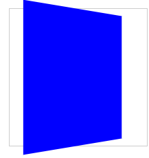

两种方式有差别！函数形式便于直接对单个元素应用 3D 变换。但如果有多个元素，每个元素位置不同，使用函数形式，每个元素的消失点将不同。如果想让所有元素共享一个 3D 空间，可以在它们的*父容器上*设置 `perspective` 属性。下面是比较：

```css
#red figure {
    background: red;
    transform: perspective( 400px ) rotateY(45deg);
}
```

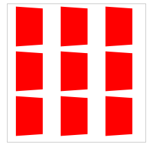

```css
#blue {
  perspective: 400px;
}

#blue figure {
  background: blue;
  transform: rotateY( 45deg );
}
```

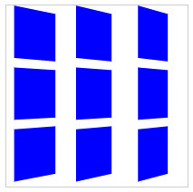

`perspective` 的值决定 3D 效果的强度（intensity）。可以认为它是观察者到对象的距离。值越大，距离越大，视觉效果越小。`perspective: 2000;` 产生较弱的 3D 效果，好像从很远观察物体。`perspective: 100;` 产生巨大的 3D 效果，好像一个小昆虫观察大的物体。

## 3D 变换函数

3D 变换与 2D 变换一样使用 `transform` 属性。

```css
rotateX(angle)
rotateY(angle)
rotateZ(angle)
translateZ(tz)
scaleZ(sz)
```

`translateZ()` 沿 Z 轴移动物体。正值让元素靠近观察者，负值令其远离。

旋转函数使元素绕轴旋转。`rotateX(45deg)` 让元素绕水平 X 轴旋转，元素顶边向后移动，底边靠近观察者。

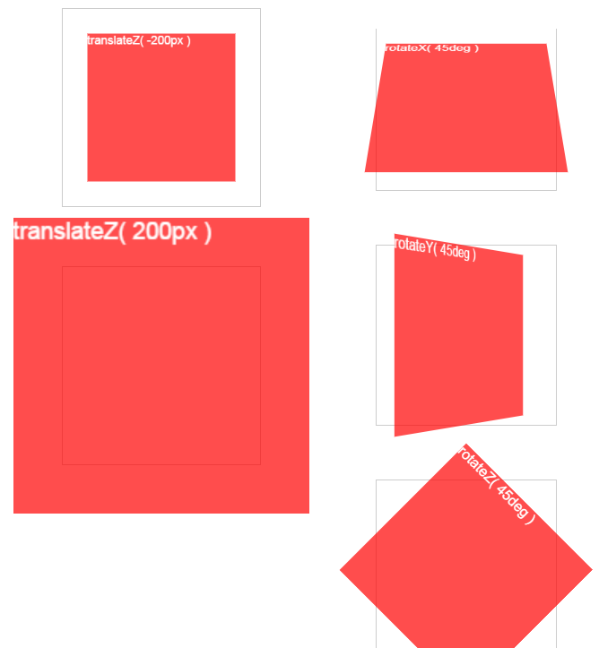

还有一种缩写形式：

```css
translate3d(tx,ty,tz)
scale3d(sx,sy,sz)
rotate3d(rx,ry,rz,angle)
```

这种形式还有一个好处可以触发 Safari 的硬件加速。

## perspective-origin

`perspective-origin` determines the appearance of the viewer’s position.

3D 空间的消失点默认在中心。可以通过 `perspective-origin` 属性改变消失点的位置：

```css
-webkit-perspective-origin: 25% 75%;
```

在线例子：http://desandro.github.io/3dtransforms/examples/perspective-03.html

例子，

```css
#parent {
    perspective: 500px;
}

#div1 {
    position: absolute;
    transform-origin: 0px 0px;
    transform: rotateY(30deg);
}

#div2 {
    position: absolute;
    transform-origin: 0px 0px;
    transform: rotateY(30deg) translate(220px);
}
```

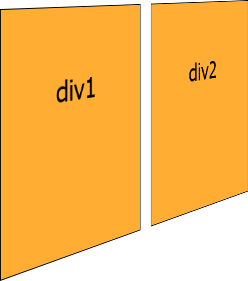

`perspective-origin` 属性与 `perspective` 连用，可以将 viewpoint 从元素中心移开。

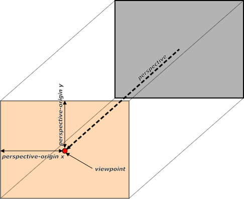

例子，将透视原点左移，这样右边离开的会更远。


```css
#parent {
    perspective: 500px;
    perspective-origin: -300px 0px;
}
```

## backface-visibility

{{一个正方体，有不透明和透明正方体两种。在一面画一个东西，旋转正方体180度，对于不透明的正方体，画的东西将不可见。但对于透明的正方体，可以透过正方体看到画的东西的背面。这里的backface指的就是这个背面，即是正方体一个面的正面和背面，而不是正方体的对着的两个面。`backface-visibility` 设为hidden就相当于把一个透明的正方体改成一个不透明的正方体。}}

`backface-visibility` 属性用于隐藏内容的背面（backface）。By default, the backface is visible and the transformed content can be seen even when flipped. But when backface-visibility is set to hidden, content is hidden when the element is rotated such that the front side is no longer visible. 该属性可以用于实现有多个边的对象，如下图的扑克牌。By setting backface-visibility to hidden, it’s easy to ensure that only the front-facing sides are visible.

```css
.card, .card div {
    position: absolute;
    width: 102px;
    height: 143px;
}

.card div:nth-child(1) {
    background-image: url('redback.png');
}

.card div:nth-child(2) {
    background-image: url('8clubs.png');
    backface-visibility: hidden;
}
```
```html
<div class="card"><div></div><div></div></div>
```

Creating six cards as defined above and giving each a `style="transform: rotateY(ndeg)"` property with a different rotation value n, results in this:

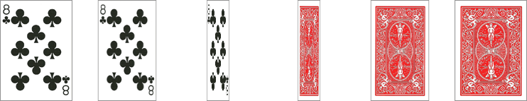

未发生旋转时，显示的是第二个div，即显示梅花8，因为按绘制顺序（注意绝对定位）它在上面。但如果转90度后，因为第二个div设置了 `backface-visibility: hidden;`，于是它不可见了。

## 最佳实践总结

* 在父容器上使用 `perspective` 属性，建立 3D 空间。
* 在 3D 对象的根对象上使用 `transform-style: preserve-3d`，确保后代也呆在 3D 空间中。

## 例子

### 翻牌

```html
<section class="container">
    <div id="card">
        <figure class="front">1</figure>
        <figure class="back">2</figure>
    </div>
</section>
```

容器负责建立 3D 空间。`#card` 作为 3D 对象的包装。纸牌的两面是两个独立的元素。**我推荐所有 3D 变换都使用此模式**。把 3D 空间元素和对象元素分开更清晰易懂。{{实践正面应遵循此模式否则可能会有一些问题。特别是，貌似绝对应该把 `transform-style` 和 `perspective` 两个属性分开！`perspective` 放在容器上，`transform-style` 放在容器**内**的3D对象上。}}

首先对父容器设定大小，并利用透视建立 3D 空间。

```css
.container {
    width: 200px;
    height: 260px;
    position: relative;
    -webkit-perspective: 800;
}
```

`#card` 可以在父容器的 3D 空间变换。设置 `width: 100%;` 和 `height: 100%;` 的目的是确保对象的 `transform-origin` 位于中心。

```css
#card {
    width: 100%;
    height: 100%;
    position: absolute;
    -webkit-transform-style: preserve-3d;
    -webkit-transition: -webkit-transform 1s;
}
```

容器的透视只对**直接后代**生效，即 `#card`。为了让后续后代继承父容器的透视，进入 3D 空间，使用 `transform-style: preserve-3d`。若没有 `transform-style`，the faces of the card would be flattened with its parents and the back face’s rotation would be nullified.

设置 `backface-visibility: hidden`，表示当一面反转到背后时，隐藏它：

```css
#card figure {
    display: block;
    position: absolute;
    width: 100%;
    height: 100%;
    -webkit-backface-visibility: hidden;
}
```

首先，正面朝上时，它后面翻过去，为此设置 `rotateY(180deg)`：

```css
#card .front {
    background: red;
}
#card .back {
    background: blue;
    -webkit-transform: rotateY(180deg);
}
```

设置反面朝上时对的状态：

```css
#card.flipped {
    -webkit-transform: rotateY(180deg);
}
```

现在我们有了一个 3D 对象。反面只要增删 `flipped` 类。

在线例子：http://desandro.github.com/3dtransforms/examples/card-01.html

### 滑动反转

上一节的反转的轴位于卡牌中心，反转时，靠近观察者的一边的上下两个角会超出容器。如下图左侧。如果不想超出容器，需要把轴放在卡牌的一边（靠近观察者的一边）。见下图右侧。


方法是设置 `transform-origin`。

```css
#card { -webkit-transform-origin: right center; }
```

把轴移动后，为了包装反转后卡牌还是在容器内，不仅要反转，还要反向水平移动（注意与上一节的另一个例子时，现在是逆时针转动了 —— 所以轴要在右边而不是左边）：

```css
#card.flipped {
    -webkit-transform: translateX(-100%) rotateY(-180deg);
}
```

在线例子：http://desandro.github.com/3dtransforms/examples/card-02-slide-flip.html

### 立方体

需要 6 个元素表示六个面：

```html
<section class="container">
    <div id="cube">
        <figure class="front">1</figure>
        <figure class="back">2</figure>
        <figure class="right">3</figure>
        <figure class="left">4</figure>
        <figure class="top">5</figure>
        <figure class="bottom">6</figure>
</div>
</section>
```

3D空间建立和大小设置：

```css
.container {
    width: 200px;
    height: 200px;
    position: relative;
    -webkit-perspective: 1000;
}

#cube {
    width: 100%;
    height: 100%;
    position: absolute;
    -webkit-transform-style: preserve-3d;
}

#cube figure {
    width: 196px;
    height: 196px;
    display: block;
    position: absolute;
    border: 2px solid black;
}
```

先把角度调对：

```css
#cube .front { -webkit-transform: rotateY(0deg); }
#cube .back { -webkit-transform: rotateX(180deg); }
#cube .right { -webkit-transform: rotateY(90deg); }
#cube .left { -webkit-transform: rotateY(-90deg); }
#cube .top { -webkit-transform: rotateX(90deg); }
#cube .bottom { -webkit-transform: rotateX(-90deg); }
```

现在它们的中心还在同一点上。要把它们推到正确的位置。边长 200px，于是边距离中心 100px。于是都沿 Z 轴移动 100px。注意，由于**先做了旋转**，每个面的 Z 轴朝向都已经变化。因此虽然都是 Z 轴移动正100px。但对面的两个边实际向相反方向移动。

```css
#cube .front { -webkit-transform: rotateY(0deg) translateZ(100px); }
#cube .back { -webkit-transform: rotateX(180deg) translateZ(100px); }
#cube .right { -webkit-transform: rotateY(90deg) translateZ(100px); }
#cube .left { -webkit-transform: rotateY(-90deg) translateZ(100px); }
#cube .top { -webkit-transform: rotateX(90deg) translateZ(100px); }
#cube .bottom { -webkit-transform: rotateX(-90deg) translateZ(100px); }
```

立方体已经就绪。但有另一个问题。For the sake of our users, our 3-D transforms should not distort the interface when the active panel is at its resting position. But once we start pushing elements off their Z-axis origin, distortion is inevitable.

In order to keep 3-D transforms snappy, Safari composites the element, then applies the transform. Consequently, anti-aliasing on text will remain whatever it was before the transform was applied. When transformed forward in 3-D space, significant pixelation can occur.

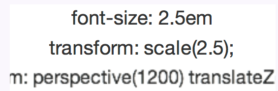

To resolve the distortion and restore pixel perfection to our `#cube`, we can push the 3-D object back, so that the front face will be positioned back to the Z-axis origin.

```css
#cube { -webkit-transform: translateZ(-100px); }
```

在线例子：http://desandro.github.com/3dtransforms/examples/cube-01-steps.html

旋转立方体通过旋转 `#cube`实现。注意到显示一个面使用的变换样式与这个面自己的样式正好相反。

```css
#cube.show-front { -webkit-transform: translateZ(-100px) rotateY(0deg); }
#cube.show-back { -webkit-transform: translateZ(-100px) rotateX(-180deg); }
#cube.show-right { -webkit-transform: translateZ(-100px) rotateY(-90deg); }
#cube.show-left { -webkit-transform: translateZ(-100px) rotateY(90deg); }
#cube.show-top { -webkit-transform: translateZ(-100px) rotateX(-90deg); }
#cube.show-bottom { -webkit-transform: translateZ(-100px) rotateX(90deg); }
```

添加过场：

```css
#cube { -webkit-transition: -webkit-transform 1s; }
```

在线例子：http://desandro.github.com/3dtransforms/examples/cube-02-show-sides.html

### 不规则立方体

长宽高：300 pixels、200 pixels、100 pixels。

```css
.container {
    width: 300px;
    height: 200px;
    position: relative;
    -webkit-perspective: 1000;
}
#box {
    width: 100%;
    height: 100%;
    position: absolute;
    -webkit-transform-style: preserve-3d;
}
```

Now to position the faces. Each set of faces will need their own sizes. The smaller faces (left, right, top and bottom) need to be positioned in the centre of the container, where they can be easily rotated and then shifted outward. The thinner left and right faces get positioned left: 100px ((300 − 100) ÷ 2), The stouter top and bottom faces get positioned top: 50px ((200 − 100) ÷ 2).

```css
#box figure {
    display: block;
    position: absolute;
    border: 2px solid black;
}
#box .front, #box .back {
    width: 296px;
    height: 196px;
}
#box .right, #box .left {
    width: 96px;
    height: 196px;
    left: 100px;
}
#box .top, #box .bottom {
    width: 296px;
    height: 96px;
    top: 50px;
}
```

旋转角度与立方体没有差别，但平移位置不同：

```css
#box .front { -webkit-transform: rotateY(0deg) translateZ(50px); }
#box .back { -webkit-transform: rotateX(180deg) translateZ(50px); }
#box .right { -webkit-transform: rotateY(90deg) translateZ(150px); }
#box .left { -webkit-transform: rotateY(-90deg) translateZ(150px); }
#box .top { -webkit-transform: rotateX(90deg) translateZ(100px); }
#box .bottom { -webkit-transform: rotateX(-90deg) translateZ(100px); }
```

在线例子：http://desandro.github.com/3dtransforms/examples/box-01-steps.html

Just like the cube example, to expose a face, the #box needs to have a style to reverse that face’s transform. Both the translateZ and rotate values are the opposites of the corresponding face.

```css
#box.show-front { -webkit-transform: translateZ(-50px) rotateY(0deg); }
#box.show-back { -webkit-transform: translateZ(-50px) rotateX(-180deg); }
#box.show-right { -webkit-transform: translateZ(-150px) rotateY(-90deg); }
#box.show-left { -webkit-transform: translateZ(-150px) rotateY(90deg); }
#box.show-top { -webkit-transform: translateZ(-100px) rotateX(-90deg); }
#box.show-bottom { -webkit-transform: translateZ(-100px) rotateX(90deg); }
```

在线例子：http://desandro.github.com/3dtransforms/examples/box-02-show-sides.html

### 旋转木马

HTML 与之前的例子都类似：

```html
<div class="container">
    <div id="carousel">
        <figure>1</figure>
        <figure>2</figure>
        <figure>3</figure>
        <figure>4</figure>
        <figure>5</figure>
        <figure>6</figure>
        <figure>7</figure>
        <figure>8</figure>
        <figure>9</figure>
    </div>
</div>
```

Now, apply basic layout styles. Let’s give each panel of the #carousel 20 pixel gaps between one another, done here with left: 10px; and top: 10px;. The effective width of each panel is 210 pixels.

```css
.container {
    width: 210px;
    height: 140px;
    position: relative;
    -webkit-perspective: 1000;
}
#carousel {
    width: 100%;
    height: 100%;
    position: absolute;
    -webkit-transform-style: preserve-3d;
}
#carousel figure {
    display: block;
    position: absolute;
    width: 186px;
    height: 116px;
    left: 10px;
    top: 10px;
    border: 2px solid black;
}
```

Next up: rotating the faces. This #carousel has nine panels. If each panel gets an equal distribution on the carousel, each panel would be rotated forty degrees from its neighbour (360 ÷ 9).

```css
#carousel figure:nth-child(1) { -webkit-transform: rotateY(0deg); }
#carousel figure:nth-child(2) { -webkit-transform: rotateY(40deg); }
#carousel figure:nth-child(3) { -webkit-transform: rotateY(80deg); }
#carousel figure:nth-child(4) { -webkit-transform: rotateY(120deg); }
#carousel figure:nth-child(5) { -webkit-transform: rotateY(160deg); }
#carousel figure:nth-child(6) { -webkit-transform: rotateY(200deg); }
#carousel figure:nth-child(7) { -webkit-transform: rotateY(240deg); }
#carousel figure:nth-child(8) { -webkit-transform: rotateY(280deg); }
#carousel figure:nth-child(9) { -webkit-transform: rotateY(320deg); }
```

Now, the outward shift. Back when we were creating the cube and box, the translate value was simple to calculate, as it was equal to one half the width, height or depth of the object. With this carousel, there is no size we can automatically use as a reference. We’ll have to calculate the distance of the shift by other means.

Drawing a diagram of the carousel, we can see that we know only two things: the width of each panel is 210 pixels; and the each panel is rotated forty degrees from the next. If we split one of these segments down its centre, we get a right-angled triangle, perfect for some trigonometry.

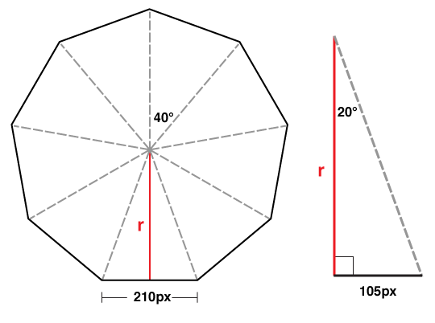

There you have it: the panels need to be translated 288 pixels in 3-D space.

```css
#carousel figure:nth-child(1) { -webkit-transform: rotateY(0deg) translateZ(288px); }
#carousel figure:nth-child(2) { -webkit-transform: rotateY(40deg) translateZ(288px); }
#carousel figure:nth-child(3) { -webkit-transform: rotateY(80deg) translateZ(288px); }
#carousel figure:nth-child(4) { -webkit-transform: rotateY(120deg) translateZ(288px); }
#carousel figure:nth-child(5) { -webkit-transform: rotateY(160deg) translateZ(288px); }
#carousel figure:nth-child(6) { -webkit-transform: rotateY(200deg) translateZ(288px); }
#carousel figure:nth-child(7) { -webkit-transform: rotateY(240deg) translateZ(288px); }
#carousel figure:nth-child(8) { -webkit-transform: rotateY(280deg) translateZ(288px); }
#carousel figure:nth-child(9) { -webkit-transform: rotateY(320deg) translateZ(288px); }
```

If we decide to change the width of the panel or the number of panels, we only need to plug in those two variables into our equation to get the appropriate translateZ value. In JavaScript terms, that equation would be:

```js
var tz = Math.round( ( panelSize / 2 ) / Math.tan( ( ( Math.PI * 2 ) / numberOfPanels ) / 2 ) );
// or simplified to
var tz = Math.round( ( panelSize / 2 ) / Math.tan( Math.PI / numberOfPanels ) );
```

Just like our previous 3-D objects, to show any one panel we need only apply the reverse transform on the carousel. Here’s the style to show the fifth panel:

```css
-webkit-transform: translateZ(-288px) rotateY(-160deg);
```

在线例子：http://desandro.github.com/3dtransforms/examples/carousel-01.html

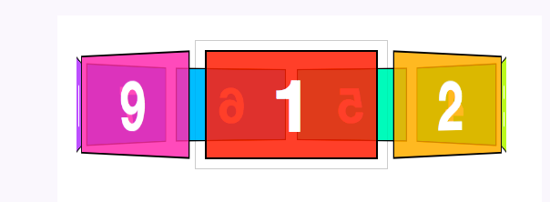

By now, you probably have two thoughts:

1. Rewriting transform styles for each panel looks tedious.
2. Why bother doing high school maths? Aren’t robots supposed to be doing all this work for us?

And you’re absolutely right. The repetitive nature of 3-D objects lends itself to scripting. We can offload all the monotonous transform styles to our dynamic script, which, if done correctly, will be more flexible than the hard-coded version.

在线例子：http://desandro.github.com/3dtransforms/examples/carousel-02-dynamic.html

### 3D变换与动画/过场

3D 变换可以与 transitions 和 animations 一起使用。

```css
#parentDiv {
    perspective: 500px;
    perspective-origin: 150px 500px;
}

#div1 {
    transform-origin: 150px 500px;
    animation: scrollText 200s linear infinite;
}

@keyframes scrollText {
    0% { transform: rotateX(45deg) translateY(500px); }
    100% { transform: rotateX(45deg) translateY(-8300px); }
}
```

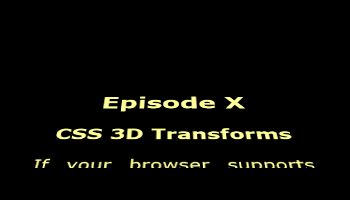
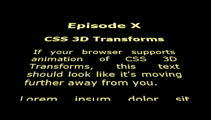
