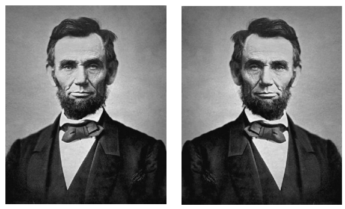

[toc]

# CSS 动画：transform

## 2D 变换

有四个主要的变换函数：`translate`, `rotate`, `scale`, `skew`。这些函数通过组合进 `matrix` 变换函数。

### 原点

用 `transform-origin` 改变变换的原点。默认在中心。其取值与 `background-position` 类似。两个值分别表示水平和垂直偏移。可以使用关键字（top, center, bottom, left, right）和数值，位置可以位于元素之外。

例如，原点放在左上角，可以表述为等价的三种形式：

```css
transform-origin: left top;
transform-origin: 0 0; // 像素
transform-origin: 0% 0%;
```

### 旋转

旋转图片。可以是浮点数。正负值分别表示顺时针和逆时针变换。

```html

```

单位：

* `deg`： 360度，如 `rotate(90deg)`。
* `grad`：用于简化计算：一圈算 400 grad。如 `rotate(100grad)`。
* `rad`： 一圈 2π。如 `rotate(1.57rad)`。
* `turn`：表示一圈。如 `rotate(.25turn)`。

注意问题：

* 页面上的其他内容的布局不受变换影响。因此可能出现交叠。
* DOM 不受影响。被变换的元素的属性值（如 `offsetWidth`）保持不变。
* CSS transform 本质上对变换元素进行相对定位；元素原来位置保持不动。
* 如果 `overflow` 设为 `scroll` 或 `auto`，因变换导致的溢出会导致滚动条出现。
* 其他 CSS 规则在变换前施加，特效会随着旋转。
* 值总是要带单位，即使是 0。

若需要绕右上角转到，需要设置 `transform-origin`：

```css
img.tilt {
	width: 300px; height: 300px; float: left;
	transform-origin: right top;
	transform: rotate(−10deg);
}
```


### 缩放

`scale` 函数的参数是乘数。如 `scale(2)` 长宽放大2倍。`scale(.5)` 长宽缩小一倍。

利用负值可以反转图像。例如左右反转：

```html

```



水平和垂直方向可以独立缩放，例如：

```css
transform: scale(.5, 2);
```

或者使用独立的函数：`scaleX` 用于水平缩放、`scaleY` 用于垂直缩放。

### 平移

`translate(x, y)` 沿水平和垂直方向移动元素。`translateX()` 沿水平移动；`translateY()` 垂直移动。

```css
transform: translate(50px, -4em);
```

### 斜切（Skew）

`transform: skewX(21deg)` 设置元素的左右两边相对垂线偏移 21 度，即整个元素向右斜切。


拉伸也有两个独立的函数：`skewX` 和 `skewY`。

### 组合 Transform

两种组合方式：`transform` 属性中空格分隔多个函数；或作为 `matrix` 属性的值。

空格分隔的多个`transform`属性值：

```css
transform: translate(50px, -4em) rotate(15deg);
```

`matrix` 属性的写法略。

注意，写多个 `transform` 属性不会组合变换！最后一个变换声明会覆盖前面的。

```css
transform: translate(50px, -4em);
transform: rotate(15deg);
```