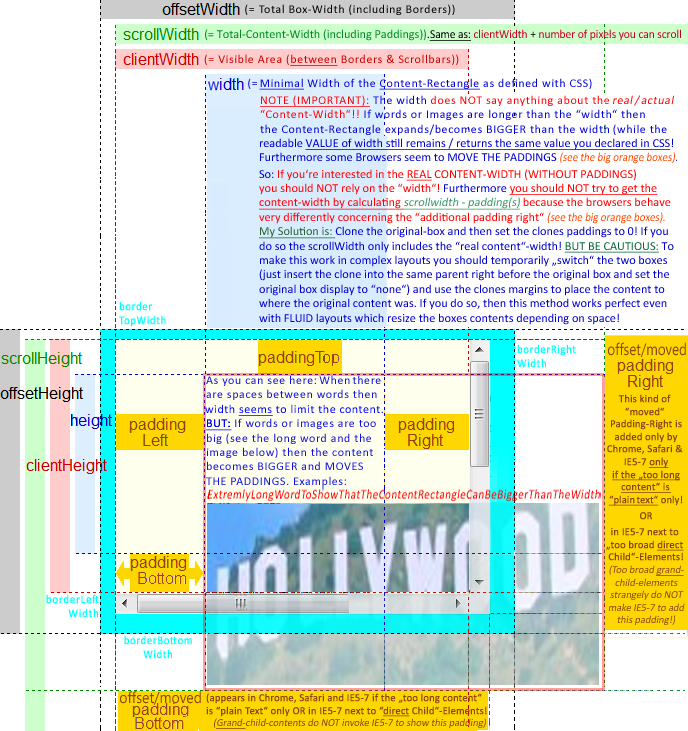

[toc]

# 布局-JavaScript

## 大小

### JavaScript 读取宽高

#### 1、clientWidth 和 clientHeight

内盒大小 + padding 大小，不包含滚动条。对于内联元素 `clientWidth` `clientHeight` 总是返回 `0`。

#### 2、offsetHeight 和 offsetWidth

内盒大小 + padding 大小 + 滚动条大小 + border 大小。`getBoundingClientRect()` 返回的对象的 `height` 和 `width` 与这两个属性等价。

内联元素可能跨多行，因此可能包含多个矩形。如第一行末尾的矩形和第二个开头的矩形。调用内联元素的 `getBoundingClientRect()` 返回的是包围所有这些矩形的矩形。例如对于换行的内联元素，矩形包含两个行的全部宽度。

#### 3、scrollWidth 和 scrollHeight

> 该属性会被取整。如果想要小数，使用 `element.getBoundingClientRect()`。

**有滚动条时**

子元素的外盒仍然在父元素的内盒内。只是子元素的右 margin 和父元素的右 padding 会被丢弃。上下和左 padding / margin 正常。

`scrollWidth` 包括子元素的 **CSS** width 、两侧 padding、两侧 border、左侧 margin，加自身的左侧 padding。即子元素的右侧 margin 和自身的右侧 padding 不包括在 `scrollWidth` 中。

`scrollHeight` 包括子元素的 **CSS** height 、两侧 padding、两侧 border、两侧 margin，加自身的两侧 padding。算法与 `scrollWidth` 不同。

例子：

```html
<div style="width: 100px; height: 200px; padding:8px; margin: 20px; border: 5px solid green; overflow: auto;">
    <div style="width: 80px; height: 200px; border: 5px solid #000; padding: 10px; margin: 6px; background: red;"></div>
</div>
```

外层 div 的 `scrollWidth` 为 124，`scrollHeight` 为 258。（Chrome 测试）

**无滚动条时（子元素外盒小于父元素内盒）**

元素的 `scrollWidth` 等于其 `clientWidth`，`scrollHeight` 等于其 `clientHeight`；与子元素无关。

#### 4、getComputedStyle()

`getComputedStyle(element)` 返回的对象表示元素计算出的样式属性。`width` 和 `height` 返回一个字符串，`px` 结尾。这两个值的含义取决于浏览器：

* Chrome 浏览器为内盒的宽高。即 CSS 的 `width` / `height` 减去滚动条。
* 对于其他浏览器，等于 CSS 的 `width` / `height`，即内盒大小 + 滚动条。

#### 5、style.width 和 style.height

元素的 `style` 属性的子属性 `width` 和 `height`，它们返回元素内联样式中设置的 `width` 和 `height`。**若没有设置内联样式返回空**。若设置了返回设置了的字符串，设置什么单位就返回什么单位。因此基本上读取这两个属性是没有意义的。

### JavaScript 设置尺寸

通过 JavaScript 设置元素个组件大小，只能通过元素的 `style` 属性，如 `div.style.width = "10px"`。本质上设置的是元素的内联样式。可以设置所有内联样式允许的属性，如 `width` `padding` `borderTopWidth` `marginBottom` 等。

### JavaScript 间接尺寸读写

1、读取滚动条宽度/高度

```
滚动条宽度 = offsetWidth - clientWidth
    - pxToNumber(computedStyle.borderLeftWidth) - pxToNumber(computedStyle.borderRightWidth)
```

滚动条高度类似。

2、读取外盒宽度/高度

```
外盒宽度 = offsetWidth + pxToNumber(computedStyle.marginLeft) +
    pxToNumber(computedStyle.marginRight)
```

外盒高度亦然。

3、设置外盒宽度/高度

思路：我们只能设置内联 CSS 的 `width`，因此要把外盒宽度转换为此宽度。

```
style.width = numberToPx(outerWidth - horizontalPBM(computedStyle))
```

高度亦然。

4、读取内盒宽度/高度

稳定的方法是用 `clientWidth` 减去 `padding`。注意仅在 Chome 下 `computedStyle.width` 等于内盒宽度。

4、设置内盒宽度/高度

我们想确保内盒为指定尺寸，为了设置 CSS 的宽高时要在指定尺寸基础上加滚动条宽度。

```
style.width = numberToPx(innerWidth + scrollBarWidth)
```

### 元素的右 padding 和下 padding 在内盒边缘还是内容盒子边缘的问题

参见：http://stackoverflow.com/a/33672058



### 浏览器视口大小

与滚动条位置一样，IE8 不支持标准做法，IE 中的可行方法取决于浏览器处于 quirks 模式还是标准模式。下面给出获取视口大小的通用方法：

```js
// Return the viewport size as w and h properties of an object
function getViewportSize(w) {
    // Use the specified window or the current window if no argument
    w = w || window;
    // This works for all browsers except IE8 and before
    if (w.innerWidth != null) return {w: w.innerWidth, h:w.innerHeight};
    // For IE (or any browser) in Standards mode
    var d = w.document;
    if (document.compatMode == "CSS1Compat")
        return { w: d.documentElement.clientWidth,
            h: d.documentElement.clientHeight };
    // For browsers in Quirks mode
    return { w: d.body.clientWidth, h: d.body.clientWidth };
}
```

## 位置

### 文档坐标与视口坐标

X 轴向右，Y 轴向下。坐标系统原点可以有两个：可以相对于文档的左上角，或文档所在的视口的左上角。定义在 Frame 中的文档，视口 `<iframe>` 元素。（有时视口坐标也被称为窗口（window）坐标）。

通过 CSS 指定元素位置时使用的是文档坐标。但查询元素位置最简单的方法返回的是视口坐标。在鼠标事件中，鼠标指针的坐标是视口坐标。

### 相对于 offsetParent 的 offsetTop 和 offsetLeft

`offsetTop` 和 `offsetLeft` 是元素节点相对于 `offsetParent` 的偏移像素。偏移是元素的 border 外边缘到 `offsetParent` 的 border 内边缘偏移。

`offsetParent` 是定位祖先：最近的 `position` 值不为 `static` 的元素。如果找不到选 `<body>` 元素（或其他 document）。寻找过程中遇到 `<td>` `<th>` `<table>` 则选这些元素，即使它们的 `position` 值为 `static`。

当 `offsetParent` 是 `<body>`， 且 `<body>` 或 `<html>` 有 margin/padding/border，多数浏览器会把相对于“边框外”改成“边框内”。

### getBoundingClientRect()

`getBoundingClientRect()` 返回一个对象，带有 `top` `right` `bottom` `left` 四个属性，表示元素的 border 外边缘相对于浏览器视口左边和顶边的距离。注意 `right` 是元素右 border 外边缘相对于视口左边而不是右边的距离。`bottom` 类似。

If you want to query the individual rectangles of inline elements, call the `getClientRects()` method to obtain a read-only array-like object whose elements are rectangle objects like those returned by `getBoundingClientRect()`.

### clientLeft 和 clientTop

`clientLeft` 和 `clientTop` 属性返回 padding 外缘和 border 外缘之间的距离，多数情况下就是左边和上边边框的宽度。如果元素有滚动条且滚动条在左面或上边（很少见）`clientLeft`、`clientTop` 也包含滚动条宽度。对于内联元素 `clientLeft` 和 `clientTop` 总是 0。

没有 `clientRight` 和 `clientBottom`。

### 利用 scrollTop 和 scrollLeft 读写

`scrollTop` 和 `scrollLeft` 表示已被滚动了距离。这两个属性是可写的。

### 主滚动条位置

```js
function getScrollOffsets(w) {
    // Use the specified window or the current window if no argument
    w = w || window;
    // 除了 IE8
    if (w.pageXOffset != null) return {x: w.pageXOffset, y:w.pageYOffset};
    // For IE (or any browser) in Standards mode
    var d = w.document;
    if (document.compatMode == "CSS1Compat")
        return {x:d.documentElement.scrollLeft, y:d.documentElement.scrollTop};
    // For browsers in Quirks mode
    return { x: d.body.scrollLeft, y: d.body.scrollTop };
}
```

## 利用 elementFromPoint() 获知在某个点最上面的元素

利用 `document` 的 `elementFromPoint(left, top)` 获知在某个点最上面的元素。其中 left、top 是相对于是视口左边与顶边的距离。

如果指定点超出视口，`elementFromPoint()` 将返回 `null`，即使这个点转换成文档坐标后是有效的。

`elementFromPoint()` 看似很有用，如判断当前鼠标经过的元素。但实际鼠标事件已经通过 `target` 属性包含了这个信息。 `elementFromPoint()` 很少在实际中使用。

## 利用 scrollIntoView() 将元素滚动到视野内

若一个节点在一个可滚动的容器内，可以让该节点滚动到视野内。

```js
document.querySelector('content').children[4].scrollIntoView(true);
```

默认尝试令元素上边接近视口上边。如果传入一个 `false`。则尝试令元素下边接近视口下边。如果需要浏览器还会水平滚动视口让元素可见。

## 精确滚动

`scrollTo()` 和 `scrollBy()` 都是 `window` 对象的方法。

除了设置 `scrollTop` 或 `scrollLeft`，还可以使用 `scrollTo()`（或 `scroll()`）。传入一个**文档坐标**，令这个点滚到视口的左上角。如果位置太接近底边或右边，则尽可能滚的远。

例子，滚到文档底部：

```js
// 获取文档和视口的高度
var documentHeight = document.documentElement.offsetHeight;
var viewportHeight = window.innerHeight;
window.scrollTo(0, documentHeight - viewportHeight);
```

`scrollBy()` 则是增量的。例子：

```js
// 每200毫秒滚10像素
javascript:void setInterval(function() {scrollBy(0, 10)}, 200);
```

## jQuery 相关方法

**offset()**

`offset()` 方法返回元素的文档坐标。返回的对象包含 `left` 和 `top` 两个属性。

传入含有这两个属性的对象可以设置元素位置。如果需要会自动设置 CSS 的 `position` 属性。

```js
var elt = $("#sprite");
var position = elt.offset();
position.top += 100;
elt.offset(position);

// Move all <h1> elements to the right by a distance that depends on their
// position in the document
$("h1").offset(function(index, curpos) {
	return {left: curpos.left + 25 * index, top: curpos.top};
});
```

**position()**

`position()` 方法是只读的，返回的位置相对于 offset parent。

`offsetParent()` 返回元素的定位祖先。

**大小**

有三组查询元素宽度高度的方法。

* `width()` 和 `height()` 返回内盒宽高（不包含 padding, border, margin）
* `innerWidth()` 和 `innerHeight()` 返回的宽度和高度中含 padding。
* `outerWidth()` 和 `outerHeight()` 返回的大小中含有 padding 和 border。调用时传入 true，则同时包含元素的 margin。

```js
var body = $("body");
var contentWidth = body.width();
var paddingWidth = body.innerWidth();
var borderWidth = body.outerWidth();
var marginWidth = body.outerWidth(true);
var padding = paddingWidth-contentWidth;
var borders = borderWidth-paddingWidth;
var margins = marginWidth-borderWidth;
```

对于 Window， `width()` 和 `height()` 返回窗口的视口大小。对于 Document，`width()` 和 `height()` 返回窗口的文档大小。其他方法只能对元素调用。

`width()` 和 `height()` 还可以设置元素的宽高。若只传入数字，单位取像素。如果传入字符串，会被当成 CSS 宽度高度值，可以任意单位。

如果元素使用了 `box-sizing: border-box`，则设置的值中含 border 和 padding。

**滚动**

`scrollTop()` 和 `scrollLeft()` 用于读取、设置元素滚动条位置。两个方法能用于 Window 对象或 Document 元素。如果对 Document 调用，则返回或设置包含文档的 Window 对象的滚动条位置。
    