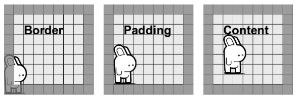

[toc]

# 背景

## 背景图像

### 多个背景图片

现在 `background-*` 属性（`background-color` 除外）基本都接受多个值，于是一个元素可以有多个背景图。多个值逗号分隔。图像列表中，先列出的图像最后绘制，或者说在最上面。使用背景图片后，其他属性可能也需要多值，例如：

```css
h2 {
    background-image: url('bunny.png'), url('landscape.jpg');
    background-position: 95% 85%, 50% 50%;
    background-repeat: no-repeat;
}
```

其中，95%、85% 分别是水平位置和垂直位置。`background-repeat` 只有一个值：如果属性值比图片少，则图像使用同一属性值。

速记属性 `background` 也可以使用多个值。逗号分隔。

```css
background:
    url('bunny.png') no-repeat 95% 85%,
    url('landscape.jpg') no-repeat 50% 50%;
```

`background-color` 是唯一不支持多值的背景属性。颜色层总是在所有图像之下。如果使用速记属性 `background`，颜色值必须放在最后一组图片前。

```css
background:
    url('bunny.png') no-repeat 95% 85%,
    #000 url('landscape.jpg') no-repeat 50% 50%;
```

不支持多值的浏览器遇到多个的背景会忽略。为兼容，需要在多值背景前声明一个兼容背景：

```css
background: url('landscape.jpg') no-repeat 50% 50%;
background:
    url('bunny.png') no-repeat 95% 85%,
    url('landscape.jpg') no-repeat 50% 50%;
```

### 图片大小

CSS3 新添加的属性 `background-size` 可以控制图片大小。属性值可以是一对值，或单个值。如 100px 宽，200px 高：

```css
background-size: 100px 200px;
```

长度单位可以是任意单位。如果是百分比，相对于容器尺寸而不是图片大小。若要保持图片大小，给值 `auto`。

若只指定一个值，值会被解释为宽度，高度取默认值 `auto`。

`background-size` 支持多个值。

规范说 `background` 属性中可以包含背景大小，只要位于 `background-position`后。但目前没有浏览器支持。

还有两个关键字：`contain` 和 `cover`。`contain` 表示尽可能放大图像（等比例），但高度和宽度都不要超过容器。`cover` 表示缩放到容器的宽度或高度中较大的值。

### 背景剪切（Clip）和原点

CSS2 中，背景图像的位置相对于元素 padding 的外缘，and any overflow will extend underneath its border. CSS3 能够进行更多控制。

`background-clip` 设置盒模型的哪部分限制背景（颜色或图像）边界。

值有三个：`border-box` `content-box` `padding-box`。`border-box` 是默认值，表示背景显示在边框后面（如果边框半透明，可以看到背景）。`padding-box` 表示背景到边框为止。`content-box` 表示背景到元素 `padding` 为止。

This property is implemented correctly in Opera and should be in both Firefox 4 and IE9. 老版本的 Firefox 的实现不标准，它用 `border` 和 `padding` 替代 `border-box` 和 `padding-box`，属性需要加 `-moz-` 前缀。

WebKit更复杂。老版本支持 `border` 和 `padding`，以及 `content`（对应 `content-box`）。属性都要加 `-webkit-` 前缀。较新的版本使用 `border-box`, `padding-box`, `content-box`；仍使用前缀。最新的版本，使用 `border-box` 和 `padding-box` 时不需要前缀，但用**content-box**时需要。


WebKit 还支持一个非标准值：`text`。当文本背景透明时，文本将以背景图像填充。To make this work compatibly with non-WebKit browsers, we should use the `-webkit-text-fill-color` that was introduced back in Chapter 6. Here’s an example:

```css
h2 {
    background: url('landscape.jpg') no-repeat 50% 60%;
    -webkit-background-clip: text;
    -webkit-text-fill-color: transparent;
}
```


CSS2 规定背景位置的计算相对于 padding。`background-origin` 可以改变相对的位置。`background-origin` 接受的关键字与 `background-clip` 相同。例子：图片位置都是 `0 100%`，即左下角，但左下角在哪里取决于 `background-origin` 的值。

```css
h2[class^='origin'] { background: url('bunny.png') no-repeat 0 100%;}
h2[class$='-brdr'] { background-origin: border-box; }
h2[class$='-cntnt'] { background-origin: content-box; }
h2[class$='-pddng'] { background-origin: padding-box; }
```



如果 `background-position` 设为 `fixed`，则 `background-origin` 无效。

在多背景的情况下，`background-clip `和 `background-origin` 都接受多个值，分别设置每个图像。

### background-repeat

`background-repeat` 之前有四个值：`no-repeat` `repeat` `repeat-x` `repeat-y`。CSS3 新增了两个值。

第一个是 `space`，在保证图像完整的情况下背景图像尽量重复多次。多余的空间放在图片直接作为间隔。
第二个是 `round`，它也是在保证图片完整的情况下尽量重复多次，然后缩放图像最终填满容器。

Although these new values are once again planned for inclusion in IE9, the only browser to implement them to date is Opera (version 10.5+).


WebKit recognizes these keywords, but treats them both incorrectly as no-repeat. Firefox ignores them and uses the previous cascaded or inherited value.