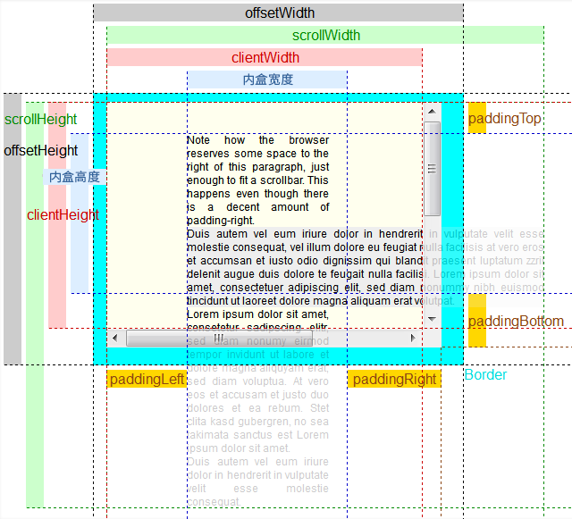
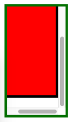
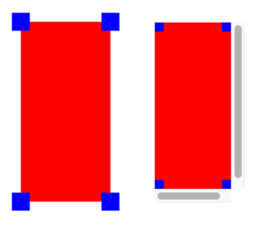
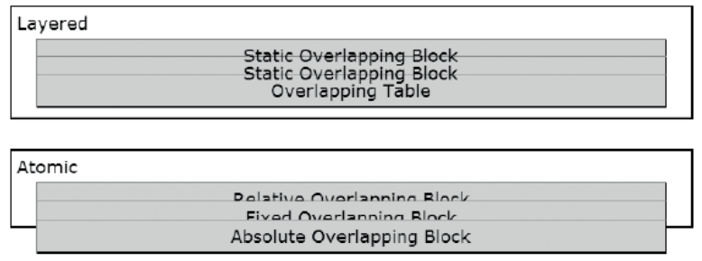

[toc]

# 布局

## CSS 盒子

6 种盒子：inline、inline-block、block、table、absolute、floated。任何元素都将被渲染成上述盒子的一种。某些元素被渲染为某种盒子的变体，如列表项或表格单元格。

## 块盒模型

> 以下讨论未考虑 `box-sizing: border-box`

块盒子从上到下在块格式化上下文中流动，称作块的正常（normal）流。

终端块在其内盒中创建内联格式化上下文，但在其外盒的外边，是块格式化上下文。

`width:auto` 是默认值，默认伸开撑满父容器宽度。`height:auto` 是默认值，默认收缩到内容高度。

对于一个大小固定的块。`margin-right:auto` 令其左对齐，`margin-left:auto` 令其右对齐。同时设置 `margin-left` 和 `margin-right` 为 `auto`，令其居中。

### 块盒大小

块元素有三个基本盒子：内盒、外盒、内容盒子。

内盒在 padding 内边缘内；外盒在 margin 外边缘外。内盒外是 padding，padding 外是滚动条，滚动条外是 border，border 外是 margin。它们的关系是：外盒宽度 = 内盒宽度 + 左右 padding 宽度 + 滚动条宽度 + border 宽度 + margin 宽度。高度类似。注意滚动条一般只有右滚动条和下滚动条。

元素的内容也会形成一个盒子（称“内容盒子”）。该盒子可能比内盒大，此时出现滚动。

CSS 属性 `width`、`height` 为内盒大小加滚动条的大小。



## 块与绝对盒子的位置

### 普通流块级元素的位置

1. 嵌套的两个块级元素，子元素的 margin 外边缘对齐父元素的 padding 内边缘。
2. 相邻的两个兄弟块级元素，上下 margin 会合并（取大者）；左右 margin 永不会合并。
3. 嵌套的两个或多个块级元素，如果父元素没有 padding 和 border，上下 margin 会合并（取大者），否则不合并；左右 margin 永不会合并。

### 普通流带滚动

> Chrome 测试

如果子元素过大导致父元素出现滚动条，则子元素的右 margin 和父元素的右 padding 会被丢弃，如下图。上下左 padding / margin 正常。

```html
<div style="width: 100px; height: 200px; padding: 10px; margin: 20px; border: 5px solid green; overflow: auto;">
    <div style="width: 80px; height: 215px; border: 5px solid #000; padding: 10px; margin: 10px; background: red;"></div>
</div>
```



### 绝对定位的位置

绝对定位的 top / left / right / bottom 是元素外盒（margin 外边缘）与父元素**滚动条**内边缘的距离；如果父元素没有滚动条，则是与 border 内边缘之间的距离，因为滚动条外就是 border 内边。

父元素的 padding 不会引起绝对定位的子元素发生进一步偏移；子元素的 margin 会引起子元素的进一步偏移。

### 负定位

如果元素的定位属性 left / right / top / bottom 为负，或这些属性与负 margin 结合导致元素定位到父元素外（如 `left: 0; margin: -10px;`），元素是否能够超出父元素边界显示取决于父元素的 `overflow` 属性：若为 `auto` / `scroll` / `hidden` 则超出部分会被隐藏；若为 `visible` 或不设置该属性，则超出部分会显示出来，如下图。



```html
<div style="width: 100px; height: 200px; position: relative; background: red; margin: 50px;">
    <div style="width: 20px; height: 20px; background: blue; position: absolute; left: -10px; top: -10px;"></div>
    <div style="width: 20px; height: 20px; background: blue; position: absolute; right: -10px; top: -10px;"></div>
    <div style="width: 20px; height: 20px; background: blue; position: absolute; right: -10px; bottom: -10px;"></div>
    <div style="width: 20px; height: 20px; background: blue; position: absolute; left: -10px; bottom: -10px;"></div>
</div>

<div style="width: 100px; height: 200px; position: relative; background: red; margin: 50px; overflow: auto;">
    <div style="width: 20px; height: 20px; background: blue; position: absolute; left: -10px; top: -10px;"></div>
    <div style="width: 20px; height: 20px; background: blue; position: absolute; right: -10px; top: -10px;"></div>
    <div style="width: 20px; height: 20px; background: blue; position: absolute; right: -10px; bottom: -10px;"></div>
    <div style="width: 20px; height: 20px; background: blue; position: absolute; left: -10px; bottom: -10px;"></div>
</div>
```

## inline 盒子

内联盒子在**内联流**（inline flow）中渲染。超出父容器（终端块）的宽度会自动换行，称为内联格式化上下文。

`width` `height` `overflow` 对内联元素无效，因为它们总是收缩到内容的宽度和高度。

水平 `margin` 改变内联元素在流中的位置。`margin-top` 和 `margin-bottom` 对内联元素无效。

内联元素使用 `line-height` 确定行高。

上下边框不会撑高行高或改变内联元素的垂直位置。为此，边框可能与相邻行重叠。当带边框的元素跨多行，浏览器不会渲染行尾的右边框，不会渲染第二行开始的行首的左边框。左右边框只存在于元素的开始和结束处。

`padding` 对内联元素的作用与 `border` 相同。{{上下 `padding` 不会撑高行。}}

## inline-block 盒子

内联块状元素包括 replaced 元素和 `display` 为 `inline-block` 的内联元素。`display:inline-block` 可以将任何内联元素变成在内联上下文中渲染的块。

注意对于 replaced 元素不必设置 `display:inline-block`，浏览器会自动设置。

内联块状盒子像内联盒子一样参与**内联流**，但可以有 margin, border, padding, width, height。一个内联块盒子不能跨多行换行。内联块盒子会撑高行的高度容纳它的 height, padding, border, margin。一个内联块盒子可以可以是收缩到内容宽度的、指定大小的、伸开的父元素大小的。

可以设置 `width` 和 `height`。

* 把高度或宽度设为固定数值，可以增大或缩小一个 replaced 元素，如图像。
* 设置 `width:auto` 和 `height:auto`，让 replaced 元素恢复其原来尺寸；对其他内联块元素，则是收紧它们到内容的尺寸。
* 通过 `width:100%` 可以让一个内联块撑开。一个撑开的内联块就像一个块。

正的 `margin-top` 扩展行高，负的减小。正的 `margin-bottom` 抬高元素位置，负的降低；同时，会撑高或减少行高。

`border` 和 `padding` 会增大内联元素的外尺寸。同时会抬高元素位置，增加包围它的行的高度。

## 定位

CSS 提供 6 种定位模型：静态、绝对、fixed、相对、浮动和相对浮动。

`position:static` 让元素不再定位，回到流中正常渲染。已定位元素有三种：`position:relative` `position:absolute` `position:fixed`。浮动可以通过 `position:relative` 定位。

元素定位相对于离它最近的、已定位的祖先。若无，最终 `<body>` 作为定位祖先。

### 堆叠上下文

静态元素按文档顺序从后向前堆叠。已定位元素按 `z-index` 从小到大从后向前堆叠。`z-index` 为负的定位元素位于静态元素和非定位浮动之下。`z-index` 可以不连续。`z-index` 的默认值是 `auto`。

`z-index` 不为 `auto` 的定位元素会创建一个局部的、自包含的堆叠上下文。它的所有后代（静态、浮动、定位的）都在其中渲染。`z-index` 为 `auto`，或对非定位元素设置 `z-index` 都不会创建堆叠上下文。

堆叠上下文是原子的，不会允许祖先或兄弟的层插入到孩子中间。每个局部的堆叠上下文被赋予内部堆叠级别 0，它的后代都相对于此堆叠。即 `z-index` **不是全局的**。它相对于最近的带数字的 `z-index` 的定位祖先{{即相对于它的堆叠上下文}}。根元素 `<html>` 创建根堆叠上下文。

一个堆叠上下文从后向前一层层的渲染：

1. 上下文元素的背景色、图片、边框
2. 后代中，定位元素，`z-index` 为负。
3. 后代中，非定位块元素
4. 后代中，非定位的浮动
5. 后代中，非定位的内联元素
6. 后代中，定位元素，且 `z-index:auto` 或 `z-index:0`。
7. 后代中，定位元素，且 `z-index` 为正。

其中，2, 6, 7 递归渲染堆叠上下文，因为每个带数字 `z-index` 的定位元素都会创建局部堆叠上下文。

### 绝对盒子

绝对盒子的位置不影响其他盒子的位置。

`z-index` 控制一个已定位元素的堆叠顺序。负值将它们置于正常（normal）流之下，正值置于之上。值越大越靠近用户。

当 `left` 和 `right` 都被设为`auto`，浏览器在盒子本来该在的位置上渲染它。

* 当 `width` 是 `auto` 且 `left` 和 `right` 都是 `auto`，盒子会被收紧。
* 如果 `width` 是 `auto`，但 `left` 和 `right` 是 0 或其他值，盒子伸开。
* 如果 `width` 是一个值，`left` 是一个值，但 `right` 是 `auto`，盒子大小固定，对齐左边的一个位置。右对齐类似。

`height`、`top`、`bottom` 的作用与 `width`、`left`、`right` 类似。

正的 `margin` 将绝对盒子的一边向容器中心移动。负值令其远离中心。

### 原子的



你想要内容在块内部渲染，而不是在块上面渲染。即，你想要文本和内联内容被原子的渲染于块内，于是，如果块之间重叠，内容也会重叠。

问题在于，浏览器将静态内联内容渲染在一个单独的层中，位于静态块的背景之上。当静态块彼此覆盖时，它们的背景边框会遮盖，但静态内容不会。原因是，按照上一节介绍的堆叠上下文绘制顺序，首先绘制**所有**块的背景边框，然后是**所有**的浮动，然后是内联内容和元素。

解决办法是令块都定位。**定位元素是原子的**。设为 `overflow:scroll` 的块也是原子的，因为内容现在位于块的可滚动区域。

```html
<div>Atomic
<p class="relative">Relative Overlapping Block</p>
<p class="fixed">Fixed Overlapping Block</p>
<p class="absolute">Absolute Overlapping Block</p></div>
```
```css
*.static { position:static; }
*.overlap { margin-top:-22px; }
*.relative { position:relative;}
*.fixed { position:fixed;margin-top:-16px; }
*.absolute { position:absolute;top:65px; }
```

### 百分大小

设置 `width` 和 `height` 时，百分比相对于最近的定位祖先（而不是祖先）。若`left`、`right`、`top` 和 `bottom` 设为 `auto`，则元素在其本来该在的位置上渲染。利用 `margin` 可以让元素边相对于最近的定位祖先的边偏移。

## 浮动盒子

任何元素都可以通过 `float:left` 或 `float:right` 浮动。浮动元素从正常（normal）流移除，置于相邻的块的**边框和背景之上**。浮动会令浮动的父元素减小：如果所有后代都是浮动的，父级会缩小到空。

尽管浮动从流中移除，它会缩进流中相邻的内容。左浮动使得相邻内容向右缩进，右浮动反之。

浮动在垂直方向上位于它本来的位置。水平位置位于父元素 `padding` 区的左边和右边。A float stacks next to other floats in the same general vertical location. 若一个浮动 A 不能在浮动 B 旁边呆的下，浮动 A 会移动到浮动 B 之下。浮动元素的位置、大小、padding、边框和 margin 影响相邻浮动和相邻**内联内容**的位置。浮动的精确位置无法预知。

`width:auto` 是默认值，会令浮动元素收缩到容纳其最宽的行。`height:auto` 是默认值，令浮动元素收紧。

正的 margin 令浮动远离其对齐点，把其他浮动和内联内容推离它。A negative margin pulls the float to the other side of its point of alignment and pulls other floats and inline content closer. 浮动周围的 margin 不会合并。

边框和 padding 增加浮动的外尺寸。The left border and padding of a left float move the float to the right, and its right border and padding move other floats and inline content on the right further to the right. This applies vice versa for right floats. Top border and padding move the float down. The bottom border and padding move down any floats below the float, and extend the float’s effect on adjacent content in the normal flow.

## 宽度和高度

宽度：

* `width` 对内联元素无效，对各种盒模型效果不同。`width:auto` 是默认值。
* `width:auto` 水平收紧以下盒子：内联、内联块、浮动、表格、绝对盒子（`left` 和 `right` 都设为 `auto`）。
* `width:auto` 水平撑开块状盒子和绝对盒子（`left` 和 `right` 都设为一个值，如0）。

不能水平收紧（收紧到内容大小）静态块元素。

限制块的大小的另一种方式是利用 `max-height` 或 `max-width` 属性。

高度：

* `height` 对内联元素无效，对各种盒模型效果不同。`height:auto` 是默认值。
* `height:auto` 垂直收紧以下盒子：inline, inline-block, block, floated, table, absolute（需要 `top` 和 `bottom` 都为 `auto`）。
* `height:auto` 会垂直撑开绝对盒子（需要 `top` 和 `bottom` 设置一个数值，如 0）。这是垂直撑开一个盒子最好的方式，因为 `height:100%` 有限制，但它只对绝对盒子有效。
* `height:100%` 将元素拉开到父容器高度，但有一些限制。浏览器不会自动调整高度让元素保持拉伸。元素的垂直 margins, borders, padding 会导致元素高度超出父容器。

## box-sizing

设置盒子的宽度都包含哪些部分。取值可以是 `border-box` 或 `content-box`。默认是 `content-box`，表示宽度属性只包含内容。`border-box` 表示宽度属性包含内容、padding 和边框，不包括 margin。

```css
div {
    border: 10px solid black;
    box-sizing: border-box;
    padding: 10px;
    width: 150px;
}
```

Firefox 还支持一个额外的关键字 `padding-box`。即宽度包含内容和 padding，但不包含边框。


